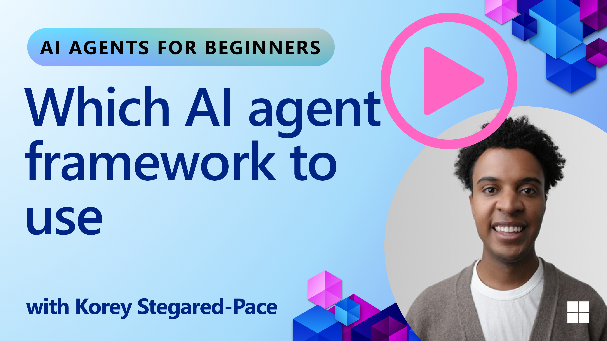

[](https://youtu.be/ODwF-EZo_O8?si=1xoy_B9RNQfrYdF7)

> _(위 이미지를 클릭하여 이 레슨의 비디오를 시청하세요)_

# AI 에이전트 프레임워크 탐색

AI 에이전트 프레임워크는 AI 에이전트의 생성, 배포 및 관리를 단순화하도록 설계된 소프트웨어 플랫폼입니다. 이러한 프레임워크는 개발자에게 복잡한 AI 시스템 개발을 간소화하는 사전 구축된 컴포넌트, 추상화 및 도구를 제공합니다.

이러한 프레임워크는 AI 에이전트 개발의 일반적인 과제에 대한 표준화된 접근 방식을 제공하여 개발자가 애플리케이션의 고유한 측면에 집중할 수 있도록 도와줍니다. 또한 AI 시스템 구축의 확장성, 접근성 및 효율성을 향상시킵니다.

## 소개

이 레슨에서 다룰 내용:

- AI 에이전트 프레임워크란 무엇이며, 개발자가 무엇을 달성할 수 있게 해주는가?
- 팀이 이를 사용하여 에이전트의 기능을 빠르게 프로토타입화하고, 반복하며, 개선하는 방법은?
- Microsoft가 만든 프레임워크와 도구인 <a href="https://aka.ms/ai-agents/autogen" target="_blank">AutoGen</a>, <a href="https://aka.ms/ai-agents-beginners/semantic-kernel" target="_blank">Semantic Kernel</a>, <a href="https://aka.ms/ai-agents-beginners/ai-agent-service" target="_blank">Azure AI Agent Service</a>의 차이점은?
- 기존 Azure 생태계 도구를 직접 통합할 수 있는가, 아니면 독립 실행형 솔루션이 필요한가?
- Azure AI Agents 서비스란 무엇이며 어떻게 도움이 되는가?

## 학습 목표

이 레슨의 목표는 다음을 이해하도록 돕는 것입니다:

- AI 개발에서 AI 에이전트 프레임워크의 역할
- 지능형 에이전트를 구축하기 위해 AI 에이전트 프레임워크를 활용하는 방법
- AI 에이전트 프레임워크가 가능하게 하는 주요 기능
- AutoGen, Semantic Kernel, Azure AI Agent Service의 차이점

## AI 에이전트 프레임워크란 무엇이며 개발자가 무엇을 할 수 있게 해주는가?

전통적인 AI 프레임워크는 다음과 같은 방식으로 앱에 AI를 통합하고 이러한 앱을 개선하는 데 도움을 줄 수 있습니다:

- **개인화**: AI는 사용자 행동과 선호도를 분석하여 개인화된 추천, 콘텐츠 및 경험을 제공할 수 있습니다.
예시: Netflix와 같은 스트리밍 서비스는 AI를 사용하여 시청 기록을 기반으로 영화와 프로그램을 제안하여 사용자 참여도와 만족도를 향상시킵니다.
- **자동화 및 효율성**: AI는 반복적인 작업을 자동화하고, 워크플로를 간소화하며, 운영 효율성을 개선할 수 있습니다.
예시: 고객 서비스 앱은 AI 기반 챗봇을 사용하여 일반적인 문의를 처리하고, 응답 시간을 줄이며, 더 복잡한 문제를 처리할 수 있도록 인간 상담원을 확보합니다.
- **향상된 사용자 경험**: AI는 음성 인식, 자연어 처리 및 예측 텍스트와 같은 지능형 기능을 제공하여 전반적인 사용자 경험을 개선할 수 있습니다.
예시: Siri 및 Google Assistant와 같은 가상 비서는 AI를 사용하여 음성 명령을 이해하고 응답하여 사용자가 장치와 더 쉽게 상호 작용할 수 있도록 합니다.

### 모두 좋게 들리는데, 왜 AI 에이전트 프레임워크가 필요한가요?

AI 에이전트 프레임워크는 단순한 AI 프레임워크 이상을 나타냅니다. 이들은 특정 목표를 달성하기 위해 사용자, 다른 에이전트 및 환경과 상호 작용할 수 있는 지능형 에이전트의 생성을 가능하게 하도록 설계되었습니다. 이러한 에이전트는 자율적인 행동을 보이고, 결정을 내리며, 변화하는 조건에 적응할 수 있습니다. AI 에이전트 프레임워크가 가능하게 하는 주요 기능을 살펴보겠습니다:

- **에이전트 협업 및 조정**: 함께 작업하고, 통신하며, 복잡한 작업을 해결하기 위해 조정할 수 있는 여러 AI 에이전트의 생성을 가능하게 합니다.
- **작업 자동화 및 관리**: 다단계 워크플로 자동화, 작업 위임 및 에이전트 간 동적 작업 관리를 위한 메커니즘을 제공합니다.
- **맥락적 이해 및 적응**: 에이전트가 맥락을 이해하고, 변화하는 환경에 적응하며, 실시간 정보를 기반으로 결정을 내릴 수 있는 능력을 갖추게 합니다.

요약하면, 에이전트는 더 많은 일을 할 수 있게 하고, 자동화를 다음 단계로 끌어올리며, 환경에서 적응하고 학습할 수 있는 더 지능적인 시스템을 만들 수 있게 해줍니다.

## 에이전트의 기능을 빠르게 프로토타입화하고, 반복하며, 개선하는 방법은?

빠르게 변화하는 환경이지만, 빠른 프로토타입 제작과 반복을 도울 수 있는 대부분의 AI 에이전트 프레임워크에 공통적인 몇 가지가 있습니다. 바로 모듈 컴포넌트, 협업 도구, 실시간 학습입니다. 이들에 대해 자세히 알아보겠습니다:

- **모듈 컴포넌트 사용**: AI SDK는 AI 및 메모리 커넥터, 자연어 또는 코드 플러그인을 사용한 함수 호출, 프롬프트 템플릿 등과 같은 사전 구축된 컴포넌트를 제공합니다.
- **협업 도구 활용**: 특정 역할과 작업을 가진 에이전트를 설계하여 협업 워크플로를 테스트하고 개선할 수 있습니다.
- **실시간 학습**: 에이전트가 상호 작용으로부터 학습하고 동적으로 행동을 조정하는 피드백 루프를 구현합니다.

### 모듈 컴포넌트 사용

Microsoft Semantic Kernel 및 LangChain과 같은 SDK는 AI 커넥터, 프롬프트 템플릿, 메모리 관리와 같은 사전 구축된 컴포넌트를 제공합니다.

**팀이 이를 활용하는 방법**: 팀은 이러한 컴포넌트를 빠르게 조합하여 처음부터 시작하지 않고도 기능적인 프로토타입을 만들 수 있으며, 빠른 실험과 반복이 가능합니다.

**실제 작동 방식**: 사용자 입력에서 정보를 추출하는 사전 구축된 파서, 데이터를 저장하고 검색하는 메모리 모듈, 사용자와 상호 작용하는 프롬프트 생성기를 사용할 수 있으며, 이 모든 것을 처음부터 구축할 필요가 없습니다.

**예제 코드**. Semantic Kernel Python 및 .Net에서 자동 함수 호출을 사용하여 모델이 사용자 입력에 응답하도록 하는 사전 구축된 AI 커넥터를 사용하는 방법의 예를 살펴보겠습니다:

``` python
# Semantic Kernel Python Example

import asyncio
from typing import Annotated

from semantic_kernel.connectors.ai import FunctionChoiceBehavior
from semantic_kernel.connectors.ai.open_ai import AzureChatCompletion, AzureChatPromptExecutionSettings
from semantic_kernel.contents import ChatHistory
from semantic_kernel.functions import kernel_function
from semantic_kernel.kernel import Kernel

# Define a ChatHistory object to hold the conversation's context
chat_history = ChatHistory()
chat_history.add_user_message("I'd like to go to New York on January 1, 2025")


# Define a sample plugin that contains the function to book travel
class BookTravelPlugin:
    """A Sample Book Travel Plugin"""

    @kernel_function(name="book_flight", description="Book travel given location and date")
    async def book_flight(
        self, date: Annotated[str, "The date of travel"], location: Annotated[str, "The location to travel to"]
    ) -> str:
        return f"Travel was booked to {location} on {date}"

# Create the Kernel
kernel = Kernel()

# Add the sample plugin to the Kernel object
kernel.add_plugin(BookTravelPlugin(), plugin_name="book_travel")

# Define the Azure OpenAI AI Connector
chat_service = AzureChatCompletion(
    deployment_name="YOUR_DEPLOYMENT_NAME",
    api_key="YOUR_API_KEY",
    endpoint="https://<your-resource>.azure.openai.com/",
)

# Define the request settings to configure the model with auto-function calling
request_settings = AzureChatPromptExecutionSettings(function_choice_behavior=FunctionChoiceBehavior.Auto())


async def main():
    # Make the request to the model for the given chat history and request settings
    # The Kernel contains the sample that the model will request to invoke
    response = await chat_service.get_chat_message_content(
        chat_history=chat_history, settings=request_settings, kernel=kernel
    )
    assert response is not None

    """
    Note: In the auto function calling process, the model determines it can invoke the
    `BookTravelPlugin` using the `book_flight` function, supplying the necessary arguments.

    For example:

    "tool_calls": [
        {
            "id": "call_abc123",
            "type": "function",
            "function": {
                "name": "BookTravelPlugin-book_flight",
                "arguments": "{'location': 'New York', 'date': '2025-01-01'}"
            }
        }
    ]

    Since the location and date arguments are required (as defined by the kernel function), if the
    model lacks either, it will prompt the user to provide them. For instance:

    User: Book me a flight to New York.
    Model: Sure, I'd love to help you book a flight. Could you please specify the date?
    User: I want to travel on January 1, 2025.
    Model: Your flight to New York on January 1, 2025, has been successfully booked. Safe travels!
    """

    print(f"`{response}`")
    # Example AI Model Response: `Your flight to New York on January 1, 2025, has been successfully booked. Safe travels! ✈️🗽`

    # Add the model's response to our chat history context
    chat_history.add_assistant_message(response.content)


if __name__ == "__main__":
    asyncio.run(main())
```
```csharp
// Semantic Kernel C# example

using Microsoft.SemanticKernel;
using Microsoft.SemanticKernel.ChatCompletion;
using System.ComponentModel;
using Microsoft.SemanticKernel.Connectors.AzureOpenAI;

ChatHistory chatHistory = [];
chatHistory.AddUserMessage("I'd like to go to New York on January 1, 2025");

var kernelBuilder = Kernel.CreateBuilder();
kernelBuilder.AddAzureOpenAIChatCompletion(
    deploymentName: "NAME_OF_YOUR_DEPLOYMENT",
    apiKey: "YOUR_API_KEY",
    endpoint: "YOUR_AZURE_ENDPOINT"
);
kernelBuilder.Plugins.AddFromType<BookTravelPlugin>("BookTravel");
var kernel = kernelBuilder.Build();

var settings = new AzureOpenAIPromptExecutionSettings()
{
    FunctionChoiceBehavior = FunctionChoiceBehavior.Auto()
};

var chatCompletion = kernel.GetRequiredService<IChatCompletionService>();

var response = await chatCompletion.GetChatMessageContentAsync(chatHistory, settings, kernel);

/*
Behind the scenes, the model recognizes the tool to call, what arguments it already has (location) and (date)
{

"tool_calls": [
    {
        "id": "call_abc123",
        "type": "function",
        "function": {
            "name": "BookTravelPlugin-book_flight",
            "arguments": "{'location': 'New York', 'date': '2025-01-01'}"
        }
    }
]
*/

Console.WriteLine(response.Content);
chatHistory.AddMessage(response!.Role, response!.Content!);

// Example AI Model Response: Your flight to New York on January 1, 2025, has been successfully booked. Safe travels! ✈️🗽

// Define a plugin that contains the function to book travel
public class BookTravelPlugin
{
    [KernelFunction("book_flight")]
    [Description("Book travel given location and date")]
    public async Task<string> BookFlight(DateTime date, string location)
    {
        return await Task.FromResult( $"Travel was booked to {location} on {date}");
    }
}
```

이 예제에서 볼 수 있는 것은 사용자 입력에서 출발지, 목적지, 항공편 예약 요청 날짜와 같은 주요 정보를 추출하는 사전 구축된 파서를 활용하는 방법입니다. 이러한 모듈식 접근 방식을 통해 상위 수준의 로직에 집중할 수 있습니다.

### 협업 도구 활용

CrewAI, Microsoft AutoGen, Semantic Kernel과 같은 프레임워크는 함께 작업할 수 있는 여러 에이전트의 생성을 용이하게 합니다.

**팀이 이를 활용하는 방법**: 팀은 특정 역할과 작업을 가진 에이전트를 설계하여 협업 워크플로를 테스트하고 개선하며 전반적인 시스템 효율성을 향상시킬 수 있습니다.

**실제 작동 방식**: 각 에이전트가 데이터 검색, 분석 또는 의사 결정과 같은 전문화된 기능을 가진 에이전트 팀을 만들 수 있습니다. 이러한 에이전트는 사용자 쿼리에 답변하거나 작업을 완료하는 것과 같은 공통 목표를 달성하기 위해 통신하고 정보를 공유할 수 있습니다.

**예제 코드 (AutoGen)**:

```python
# creating agents, then create a round robin schedule where they can work together, in this case in order

# Data Retrieval Agent
# Data Analysis Agent
# Decision Making Agent

agent_retrieve = AssistantAgent(
    name="dataretrieval",
    model_client=model_client,
    tools=[retrieve_tool],
    system_message="Use tools to solve tasks."
)

agent_analyze = AssistantAgent(
    name="dataanalysis",
    model_client=model_client,
    tools=[analyze_tool],
    system_message="Use tools to solve tasks."
)

# conversation ends when user says "APPROVE"
termination = TextMentionTermination("APPROVE")

user_proxy = UserProxyAgent("user_proxy", input_func=input)

team = RoundRobinGroupChat([agent_retrieve, agent_analyze, user_proxy], termination_condition=termination)

stream = team.run_stream(task="Analyze data", max_turns=10)
# Use asyncio.run(...) when running in a script.
await Console(stream)
```

이전 코드에서 볼 수 있는 것은 데이터를 분석하기 위해 여러 에이전트가 함께 작업하는 작업을 만드는 방법입니다. 각 에이전트는 특정 기능을 수행하며, 원하는 결과를 달성하기 위해 에이전트를 조정하여 작업이 실행됩니다. 전문화된 역할을 가진 전용 에이전트를 생성함으로써 작업 효율성과 성능을 향상시킬 수 있습니다.

### 실시간 학습

고급 프레임워크는 실시간 맥락 이해 및 적응을 위한 기능을 제공합니다.

**팀이 이를 활용하는 방법**: 팀은 에이전트가 상호 작용으로부터 학습하고 동적으로 행동을 조정하는 피드백 루프를 구현하여 지속적인 개선과 기능 개선을 이끌어낼 수 있습니다.

**실제 작동 방식**: 에이전트는 사용자 피드백, 환경 데이터 및 작업 결과를 분석하여 지식 베이스를 업데이트하고, 의사 결정 알고리즘을 조정하며, 시간이 지남에 따라 성능을 향상시킬 수 있습니다. 이러한 반복적 학습 프로세스를 통해 에이전트는 변화하는 조건과 사용자 선호도에 적응할 수 있으며, 전반적인 시스템 효과를 향상시킵니다.

## AutoGen, Semantic Kernel 및 Azure AI Agent Service의 차이점은 무엇인가?

이러한 프레임워크를 비교하는 방법은 여러 가지가 있지만, 설계, 기능 및 대상 사용 사례 측면에서 몇 가지 주요 차이점을 살펴보겠습니다:

## AutoGen

AutoGen은 Microsoft Research의 AI Frontiers Lab에서 개발한 오픈소스 프레임워크입니다. 이벤트 기반의 분산 *에이전틱* 애플리케이션에 중점을 두며, 여러 LLM과 SLM, 도구 및 고급 멀티 에이전트 디자인 패턴을 가능하게 합니다.

AutoGen은 에이전트라는 핵심 개념을 중심으로 구축되었으며, 에이전트는 환경을 인식하고, 결정을 내리며, 특정 목표를 달성하기 위해 행동을 취할 수 있는 자율적인 엔티티입니다. 에이전트는 비동기 메시지를 통해 통신하여 독립적으로 병렬로 작업할 수 있으며, 시스템 확장성과 응답성을 향상시킵니다.

<a href="https://en.wikipedia.org/wiki/Actor_model" target="_blank">에이전트는 액터 모델을 기반으로 합니다</a>. Wikipedia에 따르면, 액터는 _동시 계산의 기본 구성 요소입니다. 수신한 메시지에 응답하여 액터는 로컬 결정을 내리고, 더 많은 액터를 생성하고, 더 많은 메시지를 보내며, 수신된 다음 메시지에 응답하는 방법을 결정할 수 있습니다_.

**사용 사례**: 코드 생성 자동화, 데이터 분석 작업, 계획 및 연구 기능을 위한 사용자 지정 에이전트 구축.

다음은 AutoGen의 몇 가지 중요한 핵심 개념입니다:

- **에이전트**. 에이전트는 다음과 같은 소프트웨어 엔티티입니다:
  - **메시지를 통해 통신**, 이러한 메시지는 동기식 또는 비동기식일 수 있습니다.
  - **자체 상태를 유지**, 수신 메시지에 의해 수정될 수 있습니다.
  - **행동을 수행** 수신된 메시지 또는 상태 변경에 응답하여. 이러한 행동은 에이전트의 상태를 수정하고 메시지 로그 업데이트, 새 메시지 전송, 코드 실행 또는 API 호출과 같은 외부 효과를 생성할 수 있습니다.

  다음은 채팅 기능을 가진 자체 에이전트를 생성하는 짧은 코드 스니펫입니다:

    ```python
    from autogen_agentchat.agents import AssistantAgent
    from autogen_agentchat.messages import TextMessage
    from autogen_ext.models.openai import OpenAIChatCompletionClient


    class MyAssistant(RoutedAgent):
        def __init__(self, name: str) -> None:
            super().__init__(name)
            model_client = OpenAIChatCompletionClient(model="gpt-4o")
            self._delegate = AssistantAgent(name, model_client=model_client)

        @message_handler
        async def handle_my_message_type(self, message: MyMessageType, ctx: MessageContext) -> None:
            print(f"{self.id.type} received message: {message.content}")
            response = await self._delegate.on_messages(
                [TextMessage(content=message.content, source="user")], ctx.cancellation_token
            )
            print(f"{self.id.type} responded: {response.chat_message.content}")
    ```

    이전 코드에서 `MyAssistant`가 생성되었으며 `RoutedAgent`로부터 상속받습니다. 메시지의 내용을 출력한 다음 `AssistantAgent` 위임을 사용하여 응답을 보내는 메시지 핸들러가 있습니다. 특히 `self._delegate`에 채팅 완성을 처리할 수 있는 사전 구축된 에이전트인 `AssistantAgent`의 인스턴스를 할당하는 방법에 주목하세요.


    다음으로 AutoGen에게 이 에이전트 타입에 대해 알리고 프로그램을 시작해 봅시다:

    ```python

    # main.py
    runtime = SingleThreadedAgentRuntime()
    await MyAgent.register(runtime, "my_agent", lambda: MyAgent())

    runtime.start()  # Start processing messages in the background.
    await runtime.send_message(MyMessageType("Hello, World!"), AgentId("my_agent", "default"))
    ```

    이전 코드에서 에이전트는 런타임에 등록된 다음 에이전트에게 메시지가 전송되어 다음과 같은 출력이 생성됩니다:

    ```text
    # Output from the console:
    my_agent received message: Hello, World!
    my_assistant received message: Hello, World!
    my_assistant responded: Hello! How can I assist you today?
    ```

- **멀티 에이전트**. AutoGen은 복잡한 작업을 달성하기 위해 함께 작업할 수 있는 여러 에이전트의 생성을 지원합니다. 에이전트는 통신하고, 정보를 공유하며, 문제를 더 효율적으로 해결하기 위해 행동을 조정할 수 있습니다. 멀티 에이전트 시스템을 생성하려면 데이터 검색, 분석, 의사 결정 및 사용자 상호 작용과 같은 전문화된 기능과 역할을 가진 다양한 유형의 에이전트를 정의할 수 있습니다. 이러한 생성이 어떻게 보이는지 살펴보겠습니다:

    ```python
    editor_description = "Editor for planning and reviewing the content."

    # Example of declaring an Agent
    editor_agent_type = await EditorAgent.register(
    runtime,
    editor_topic_type,  # Using topic type as the agent type.
    lambda: EditorAgent(
        description=editor_description,
        group_chat_topic_type=group_chat_topic_type,
        model_client=OpenAIChatCompletionClient(
            model="gpt-4o-2024-08-06",
            # api_key="YOUR_API_KEY",
        ),
        ),
    )

    # remaining declarations shortened for brevity

    # Group chat
    group_chat_manager_type = await GroupChatManager.register(
    runtime,
    "group_chat_manager",
    lambda: GroupChatManager(
        participant_topic_types=[writer_topic_type, illustrator_topic_type, editor_topic_type, user_topic_type],
        model_client=OpenAIChatCompletionClient(
            model="gpt-4o-2024-08-06",
            # api_key="YOUR_API_KEY",
        ),
        participant_descriptions=[
            writer_description,
            illustrator_description,
            editor_description,
            user_description
        ],
        ),
    )
    ```

    이전 코드에서 런타임에 등록된 `GroupChatManager`가 있습니다. 이 매니저는 작가, 일러스트레이터, 편집자 및 사용자와 같은 다양한 유형의 에이전트 간의 상호 작용을 조정하는 역할을 합니다.

- **에이전트 런타임**. 프레임워크는 에이전트 간 통신을 가능하게 하고, ID와 수명 주기를 관리하며, 보안 및 개인 정보 보호 경계를 적용하는 런타임 환경을 제공합니다. 이는 에이전트가 안전하고 제어된 환경에서 실행되어 안전하고 효율적으로 상호 작용할 수 있도록 보장합니다. 관심 있는 두 가지 런타임이 있습니다:
  - **독립 실행형 런타임**. 모든 에이전트가 동일한 프로그래밍 언어로 구현되고 동일한 프로세스에서 실행되는 단일 프로세스 애플리케이션에 적합한 선택입니다. 작동 방식에 대한 그림은 다음과 같습니다:

    <a href="https://microsoft.github.io/autogen/stable/_images/architecture-standalone.svg" target="_blank">독립 실행형 런타임</a>
애플리케이션 스택

    *에이전트는 런타임을 통해 메시지를 통해 통신하며, 런타임은 에이전트의 수명 주기를 관리합니다*

  - **분산 에이전트 런타임**은 에이전트가 다른 프로그래밍 언어로 구현되고 다른 머신에서 실행될 수 있는 멀티 프로세스 애플리케이션에 적합합니다. 작동 방식에 대한 그림은 다음과 같습니다:

    <a href="https://microsoft.github.io/autogen/stable/_images/architecture-distributed.svg" target="_blank">분산 런타임</a>

## Semantic Kernel + 에이전트 프레임워크

Semantic Kernel은 엔터프라이즈급 AI 오케스트레이션 SDK입니다. AI 및 메모리 커넥터와 에이전트 프레임워크로 구성됩니다.

먼저 몇 가지 핵심 컴포넌트를 살펴보겠습니다:

- **AI 커넥터**: Python 및 C# 모두에서 사용하기 위한 외부 AI 서비스 및 데이터 소스와의 인터페이스입니다.

  ```python
  # Semantic Kernel Python
  from semantic_kernel.connectors.ai.open_ai import AzureChatCompletion
  from semantic_kernel.kernel import Kernel

  kernel = Kernel()
  kernel.add_service(
    AzureChatCompletion(
        deployment_name="your-deployment-name",
        api_key="your-api-key",
        endpoint="your-endpoint",
    )
  )
  ```

    ```csharp
    // Semantic Kernel C#
    using Microsoft.SemanticKernel;

    // Create kernel
    var builder = Kernel.CreateBuilder();

    // Add a chat completion service:
    builder.Services.AddAzureOpenAIChatCompletion(
        "your-resource-name",
        "your-endpoint",
        "your-resource-key",
        "deployment-model");
    var kernel = builder.Build();
    ```

    다음은 커널을 생성하고 채팅 완성 서비스를 추가하는 방법의 간단한 예입니다. Semantic Kernel은 이 경우 Azure OpenAI Chat Completion과 같은 외부 AI 서비스에 대한 연결을 생성합니다.

- **플러그인**: 애플리케이션이 사용할 수 있는 함수를 캡슐화합니다. 기성 플러그인과 생성할 수 있는 사용자 지정 플러그인이 모두 있습니다. 관련 개념은 "프롬프트 함수"입니다. 함수 호출을 위한 자연어 큐를 제공하는 대신 특정 함수를 모델에 브로드캐스트합니다. 현재 채팅 컨텍스트를 기반으로 모델은 요청이나 쿼리를 완료하기 위해 이러한 함수 중 하나를 호출하도록 선택할 수 있습니다. 다음은 예입니다:

  ```python
  from semantic_kernel.connectors.ai.open_ai.services.azure_chat_completion import AzureChatCompletion


  async def main():
      from semantic_kernel.functions import KernelFunctionFromPrompt
      from semantic_kernel.kernel import Kernel

      kernel = Kernel()
      kernel.add_service(AzureChatCompletion())

      user_input = input("User Input:> ")

      kernel_function = KernelFunctionFromPrompt(
          function_name="SummarizeText",
          prompt="""
          Summarize the provided unstructured text in a sentence that is easy to understand.
          Text to summarize: {{$user_input}}
          """,
      )

      response = await kernel_function.invoke(kernel=kernel, user_input=user_input)
      print(f"Model Response: {response}")

      """
      Sample Console Output:

      User Input:> I like dogs
      Model Response: The text expresses a preference for dogs.
      """


  if __name__ == "__main__":
    import asyncio
    asyncio.run(main())
  ```

    ```csharp
    var userInput = Console.ReadLine();

    // Define semantic function inline.
    string skPrompt = @"Summarize the provided unstructured text in a sentence that is easy to understand.
                        Text to summarize: {{$userInput}}";

    // create the function from the prompt
    KernelFunction summarizeFunc = kernel.CreateFunctionFromPrompt(
        promptTemplate: skPrompt,
        functionName: "SummarizeText"
    );

    //then import into the current kernel
    kernel.ImportPluginFromFunctions("SemanticFunctions", [summarizeFunc]);

    ```

    여기서 먼저 사용자가 텍스트를 입력할 수 있는 공간을 남겨두는 템플릿 프롬프트 `skPrompt`가 있습니다. `$userInput`. 그런 다음 커널 함수 `SummarizeText`를 생성한 다음 플러그인 이름 `SemanticFunctions`로 커널에 가져옵니다. Semantic Kernel이 함수가 수행하는 작업과 호출되어야 할 때를 이해하는 데 도움이 되는 함수의 이름에 주목하세요.

- **네이티브 함수**: 프레임워크가 작업을 수행하기 위해 직접 호출할 수 있는 네이티브 함수도 있습니다. 다음은 파일에서 콘텐츠를 검색하는 그러한 함수의 예입니다:

    ```csharp
    public class NativeFunctions {

        [SKFunction, Description("Retrieve content from local file")]
        public async Task<string> RetrieveLocalFile(string fileName, int maxSize = 5000)
        {
            string content = await File.ReadAllTextAsync(fileName);
            if (content.Length <= maxSize) return content;
            return content.Substring(0, maxSize);
        }
    }

    //Import native function
    string plugInName = "NativeFunction";
    string functionName = "RetrieveLocalFile";

   //To add the functions to a kernel use the following function
    kernel.ImportPluginFromType<NativeFunctions>();

    ```

- **메모리**:  AI 앱을 위한 컨텍스트 관리를 추상화하고 단순화합니다. 메모리의 아이디어는 이것이 LLM이 알아야 할 것이라는 것입니다. 이 정보를 벡터 저장소에 저장할 수 있으며, 이는 인메모리 데이터베이스 또는 벡터 데이터베이스 또는 유사한 것이 됩니다. 다음은 메모리에 *사실*이 추가되는 매우 단순화된 시나리오의 예입니다:

    ```csharp
    var facts = new Dictionary<string,string>();
    facts.Add(
        "Azure Machine Learning; https://learn.microsoft.com/azure/machine-learning/",
        @"Azure Machine Learning is a cloud service for accelerating and
        managing the machine learning project lifecycle. Machine learning professionals,
        data scientists, and engineers can use it in their day-to-day workflows"
    );

    facts.Add(
        "Azure SQL Service; https://learn.microsoft.com/azure/azure-sql/",
        @"Azure SQL is a family of managed, secure, and intelligent products
        that use the SQL Server database engine in the Azure cloud."
    );

    string memoryCollectionName = "SummarizedAzureDocs";

    foreach (var fact in facts) {
        await memoryBuilder.SaveReferenceAsync(
            collection: memoryCollectionName,
            description: fact.Key.Split(";")[1].Trim(),
            text: fact.Value,
            externalId: fact.Key.Split(";")[2].Trim(),
            externalSourceName: "Azure Documentation"
        );
    }
    ```

    이러한 사실은 메모리 컬렉션 `SummarizedAzureDocs`에 저장됩니다. 이것은 매우 단순화된 예이지만, LLM이 사용할 메모리에 정보를 저장하는 방법을 볼 수 있습니다.

이것이 Semantic Kernel 프레임워크의 기본 사항입니다. 에이전트 프레임워크는 어떤가요?

## Azure AI Agent Service

Azure AI Agent Service는 Microsoft Ignite 2024에서 소개된 최신 추가 사항입니다. Llama 3, Mistral 및 Cohere와 같은 오픈소스 LLM을 직접 호출하는 것과 같은 보다 유연한 모델을 사용하여 AI 에이전트의 개발 및 배포를 가능하게 합니다.

Azure AI Agent Service는 엔터프라이즈 애플리케이션에 적합하도록 더 강력한 엔터프라이즈 보안 메커니즘과 데이터 저장 방법을 제공합니다.

AutoGen 및 Semantic Kernel과 같은 멀티 에이전트 오케스트레이션 프레임워크와 기본적으로 작동합니다.

이 서비스는 현재 퍼블릭 프리뷰이며 에이전트 구축을 위해 Python 및 C#을 지원합니다.

Semantic Kernel Python을 사용하여 사용자 정의 플러그인으로 Azure AI Agent를 생성할 수 있습니다:

```python
import asyncio
from typing import Annotated

from azure.identity.aio import DefaultAzureCredential

from semantic_kernel.agents import AzureAIAgent, AzureAIAgentSettings, AzureAIAgentThread
from semantic_kernel.contents import ChatMessageContent
from semantic_kernel.contents import AuthorRole
from semantic_kernel.functions import kernel_function


# Define a sample plugin for the sample
class MenuPlugin:
    """A sample Menu Plugin used for the concept sample."""

    @kernel_function(description="Provides a list of specials from the menu.")
    def get_specials(self) -> Annotated[str, "Returns the specials from the menu."]:
        return """
        Special Soup: Clam Chowder
        Special Salad: Cobb Salad
        Special Drink: Chai Tea
        """

    @kernel_function(description="Provides the price of the requested menu item.")
    def get_item_price(
        self, menu_item: Annotated[str, "The name of the menu item."]
    ) -> Annotated[str, "Returns the price of the menu item."]:
        return "$9.99"


async def main() -> None:
    ai_agent_settings = AzureAIAgentSettings.create()

    async with (
        DefaultAzureCredential() as creds,
        AzureAIAgent.create_client(
            credential=creds,
            conn_str=ai_agent_settings.project_connection_string.get_secret_value(),
        ) as client,
    ):
        # Create agent definition
        agent_definition = await client.agents.create_agent(
            model=ai_agent_settings.model_deployment_name,
            name="Host",
            instructions="Answer questions about the menu.",
        )

        # Create the AzureAI Agent using the defined client and agent definition
        agent = AzureAIAgent(
            client=client,
            definition=agent_definition,
            plugins=[MenuPlugin()],
        )

        # Create a thread to hold the conversation
        # If no thread is provided, a new thread will be
        # created and returned with the initial response
        thread: AzureAIAgentThread | None = None

        user_inputs = [
            "Hello",
            "What is the special soup?",
            "How much does that cost?",
            "Thank you",
        ]

        try:
            for user_input in user_inputs:
                print(f"# User: '{user_input}'")
                # Invoke the agent for the specified thread
                response = await agent.get_response(
                    messages=user_input,
                    thread_id=thread,
                )
                print(f"# {response.name}: {response.content}")
                thread = response.thread
        finally:
            await thread.delete() if thread else None
            await client.agents.delete_agent(agent.id)


if __name__ == "__main__":
    asyncio.run(main())
```

### 핵심 개념

Azure AI Agent Service에는 다음과 같은 핵심 개념이 있습니다:

- **에이전트**. Azure AI Agent Service는 Azure AI Foundry와 통합됩니다. AI Foundry 내에서 AI 에이전트는 질문에 답변하고(RAG), 작업을 수행하거나, 워크플로를 완전히 자동화하는 데 사용할 수 있는 "스마트" 마이크로서비스 역할을 합니다. 이는 생성형 AI 모델의 힘과 실제 데이터 소스에 액세스하고 상호 작용할 수 있는 도구를 결합하여 이를 달성합니다. 다음은 에이전트의 예입니다:

    ```python
    agent = project_client.agents.create_agent(
        model="gpt-4o-mini",
        name="my-agent",
        instructions="You are helpful agent",
        tools=code_interpreter.definitions,
        tool_resources=code_interpreter.resources,
    )
    ```

    이 예에서 에이전트는 모델 `gpt-4o-mini`, 이름 `my-agent` 및 지침 `You are helpful agent`로 생성됩니다. 에이전트는 코드 해석 작업을 수행하기 위한 도구와 리소스를 갖추고 있습니다.

- **스레드 및 메시지**. 스레드는 또 다른 중요한 개념입니다. 에이전트와 사용자 간의 대화 또는 상호 작용을 나타냅니다. 스레드는 대화의 진행 상황을 추적하고, 컨텍스트 정보를 저장하며, 상호 작용의 상태를 관리하는 데 사용할 수 있습니다. 다음은 스레드의 예입니다:

    ```python
    thread = project_client.agents.create_thread()
    message = project_client.agents.create_message(
        thread_id=thread.id,
        role="user",
        content="Could you please create a bar chart for the operating profit using the following data and provide the file to me? Company A: $1.2 million, Company B: $2.5 million, Company C: $3.0 million, Company D: $1.8 million",
    )

    # Ask the agent to perform work on the thread
    run = project_client.agents.create_and_process_run(thread_id=thread.id, agent_id=agent.id)

    # Fetch and log all messages to see the agent's response
    messages = project_client.agents.list_messages(thread_id=thread.id)
    print(f"Messages: {messages}")
    ```

    이전 코드에서 스레드가 생성됩니다. 그 후 스레드에 메시지가 전송됩니다. `create_and_process_run`을 호출하여 에이전트에게 스레드에서 작업을 수행하도록 요청합니다. 마지막으로 메시지를 가져와서 로그에 기록하여 에이전트의 응답을 확인합니다. 메시지는 사용자와 에이전트 간의 대화 진행 상황을 나타냅니다. 메시지가 텍스트, 이미지 또는 파일과 같은 다양한 유형일 수 있다는 것을 이해하는 것도 중요합니다. 즉, 에이전트의 작업 결과가 예를 들어 이미지 또는 텍스트 응답이 될 수 있습니다. 개발자는 이 정보를 사용하여 응답을 추가로 처리하거나 사용자에게 제시할 수 있습니다.

- **다른 AI 프레임워크와의 통합**. Azure AI Agent 서비스는 AutoGen 및 Semantic Kernel과 같은 다른 프레임워크와 상호 작용할 수 있습니다. 이는 이러한 프레임워크 중 하나에서 앱의 일부를 구축하고 예를 들어 Agent 서비스를 오케스트레이터로 사용하거나 Agent 서비스에서 모든 것을 구축할 수 있음을 의미합니다.

**사용 사례**: Azure AI Agent Service는 안전하고 확장 가능하며 유연한 AI 에이전트 배포가 필요한 엔터프라이즈 애플리케이션을 위해 설계되었습니다.

## 이러한 프레임워크의 차이점은 무엇인가?

이러한 프레임워크 간에 많은 중복이 있는 것처럼 들리지만, 설계, 기능 및 대상 사용 사례 측면에서 몇 가지 주요 차이점이 있습니다:

- **AutoGen**: 멀티 에이전트 시스템에 대한 최첨단 연구에 초점을 맞춘 실험 프레임워크입니다. 정교한 멀티 에이전트 시스템을 실험하고 프로토타입화하기에 가장 좋은 곳입니다.
- **Semantic Kernel**: 엔터프라이즈 에이전틱 애플리케이션 구축을 위한 프로덕션 준비 에이전트 라이브러리입니다. 이벤트 기반의 분산 에이전틱 애플리케이션에 중점을 두며, 여러 LLM과 SLM, 도구 및 단일/멀티 에이전트 디자인 패턴을 가능하게 합니다.
- **Azure AI Agent Service**: Azure Foundry의 에이전트를 위한 플랫폼 및 배포 서비스입니다. Azure OpenAI, Azure AI Search, Bing Search 및 코드 실행과 같은 Azure Found에서 지원하는 서비스에 대한 연결 구축을 제공합니다.

여전히 어떤 것을 선택해야 할지 확실하지 않으신가요?

### 사용 사례

몇 가지 일반적인 사용 사례를 통해 도움을 드릴 수 있는지 살펴보겠습니다:

> Q: 저는 개념 증명 에이전트 애플리케이션을 실험하고, 학습하고, 구축하고 있으며, 빠르게 구축하고 실험할 수 있기를 원합니다
>

>A: AutoGen이 이 시나리오에 좋은 선택이 될 것입니다. 이벤트 기반의 분산 에이전틱 애플리케이션에 중점을 두고 고급 멀티 에이전트 디자인 패턴을 지원하기 때문입니다.

> Q: 이 사용 사례에 대해 AutoGen이 Semantic Kernel 및 Azure AI Agent Service보다 더 나은 선택인 이유는 무엇인가요?
>
> A: AutoGen은 이벤트 기반의 분산 에이전틱 애플리케이션을 위해 특별히 설계되어 코드 생성 및 데이터 분석 작업 자동화에 적합합니다. 복잡한 멀티 에이전트 시스템을 효율적으로 구축하는 데 필요한 도구와 기능을 제공합니다.

>Q: Azure AI Agent Service도 여기서 작동할 수 있을 것 같은데, 코드 생성 등을 위한 도구가 있지 않나요?

>
> A: 예, Azure AI Agent Service는 에이전트를 위한 플랫폼 서비스이며 여러 모델, Azure AI Search, Bing Search 및 Azure Functions에 대한 기본 제공 기능을 추가합니다. Foundry Portal에서 에이전트를 쉽게 구축하고 대규모로 배포할 수 있습니다.

> Q: 여전히 혼란스럽습니다. 하나의 옵션만 알려주세요
>
> A: 훌륭한 선택은 먼저 Semantic Kernel에서 애플리케이션을 구축한 다음 Azure AI Agent Service를 사용하여 에이전트를 배포하는 것입니다. 이 접근 방식을 사용하면 Semantic Kernel에서 멀티 에이전트 시스템을 구축하는 힘을 활용하면서 에이전트를 쉽게 유지할 수 있습니다. 또한 Semantic Kernel에는 AutoGen의 커넥터가 있어 두 프레임워크를 함께 쉽게 사용할 수 있습니다.

주요 차이점을 표로 요약해 보겠습니다:

| 프레임워크 | 초점 | 핵심 개념 | 사용 사례 |
| --- | --- | --- | --- |
| AutoGen | 이벤트 기반, 분산 에이전틱 애플리케이션 | 에이전트, 페르소나, 함수, 데이터 | 코드 생성, 데이터 분석 작업 |
| Semantic Kernel | 인간과 유사한 텍스트 콘텐츠 이해 및 생성 | 에이전트, 모듈 컴포넌트, 협업 | 자연어 이해, 콘텐츠 생성 |
| Azure AI Agent Service | 유연한 모델, 엔터프라이즈 보안, 코드 생성, 도구 호출 | 모듈성, 협업, 프로세스 오케스트레이션 | 안전하고 확장 가능하며 유연한 AI 에이전트 배포 |

이러한 각 프레임워크의 이상적인 사용 사례는 무엇인가요?

## 기존 Azure 생태계 도구를 직접 통합할 수 있는가, 아니면 독립 실행형 솔루션이 필요한가?

대답은 예입니다. 특히 Azure AI Agent Service를 사용하여 기존 Azure 생태계 도구를 직접 통합할 수 있습니다. 다른 Azure 서비스와 원활하게 작동하도록 구축되었기 때문입니다. 예를 들어 Bing, Azure AI Search 및 Azure Functions를 통합할 수 있습니다. Azure AI Foundry와의 깊은 통합도 있습니다.

AutoGen 및 Semantic Kernel의 경우 Azure 서비스와 통합할 수도 있지만, 코드에서 Azure 서비스를 호출해야 할 수 있습니다. 통합하는 또 다른 방법은 Azure SDK를 사용하여 에이전트에서 Azure 서비스와 상호 작용하는 것입니다. 또한 언급했듯이 Azure AI Agent Service를 AutoGen 또는 Semantic Kernel에서 구축된 에이전트의 오케스트레이터로 사용할 수 있으며, 이를 통해 Azure 생태계에 쉽게 액세스할 수 있습니다.

## 참고 자료

- <a href="https://techcommunity.microsoft.com/blog/azure-ai-services-blog/introducing-azure-ai-agent-service/4298357" target="_blank">Azure Agent Service</a>
- <a href="https://devblogs.microsoft.com/semantic-kernel/microsofts-agentic-ai-frameworks-autogen-and-semantic-kernel/" target="_blank">Semantic Kernel and AutoGen</a>
- <a href="https://learn.microsoft.com/semantic-kernel/frameworks/agent/?pivots=programming-language-python" target="_blank">Semantic Kernel Python Agent Framework</a>
- <a href="https://learn.microsoft.com/semantic-kernel/frameworks/agent/?pivots=programming-language-csharp" target="_blank">Semantic Kernel .Net Agent Framework</a>
- <a href="https://learn.microsoft.com/azure/ai-services/agents/overview" target="_blank">Azure AI Agent service</a>
- <a href="https://techcommunity.microsoft.com/blog/educatordeveloperblog/using-azure-ai-agent-service-with-autogen--semantic-kernel-to-build-a-multi-agen/4363121" target="_blank">Using Azure AI Agent Service with AutoGen / Semantic Kernel to build a multi-agent's solution</a>

## 이전 레슨

[AI 에이전트 및 에이전트 사용 사례 소개](../01-intro-to-ai-agents/README.md)

## 다음 레슨

[에이전틱 디자인 패턴 이해하기](../03-agentic-design-patterns/README.md)
