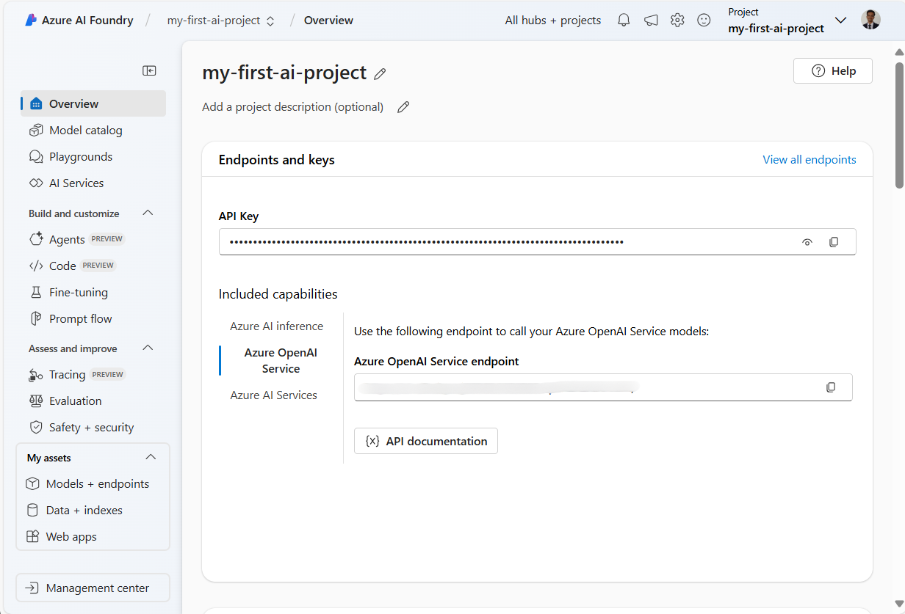
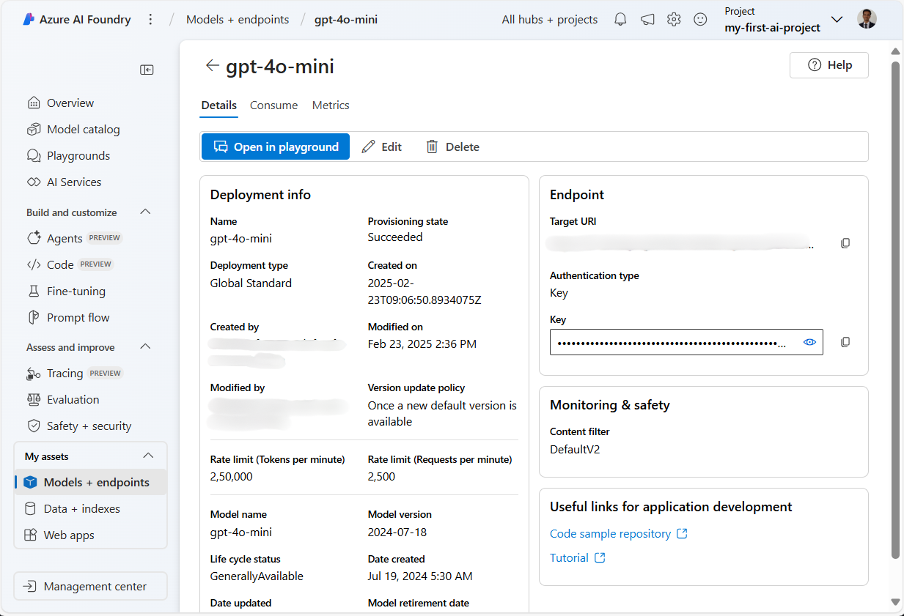
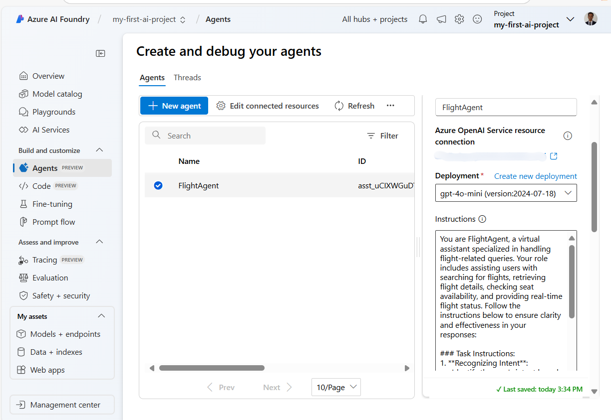
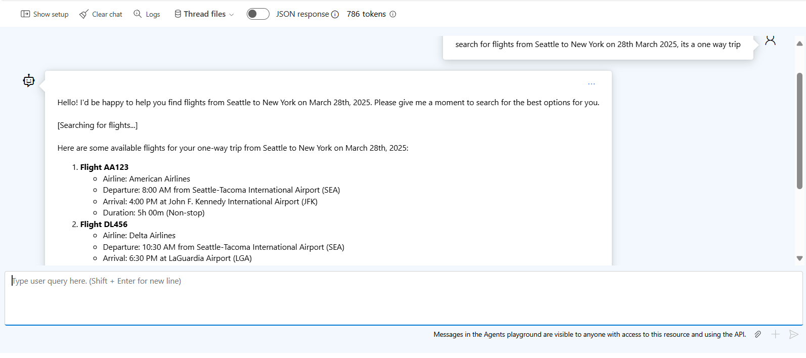

# Azure AI 에이전트 서비스 개발

이 실습에서는 [Azure AI Foundry 포털](https://ai.azure.com/?WT.mc_id=academic-105485-koreyst)의 Azure AI 에이전트 서비스 도구를 사용하여 항공편 예약용 에이전트를 생성합니다. 이 에이전트는 사용자와 상호작용하며 항공편에 대한 정보를 제공할 수 있습니다.

## 사전 요구 사항

이 실습을 완료하려면 다음이 필요합니다:
1. 활성 구독이 있는 Azure 계정. [무료 계정 만들기](https://azure.microsoft.com/free/?WT.mc_id=academic-105485-koreyst).
2. Azure AI Foundry 허브를 생성할 수 있는 권한이 있거나 허브가 생성되어 있어야 합니다.
    - 역할이 Contributor 또는 Owner인 경우 이 튜토리얼의 단계를 따를 수 있습니다.

## Azure AI Foundry 허브 생성

> **참고:** Azure AI Foundry는 이전에 Azure AI Studio로 알려졌습니다.

1. [Azure AI Foundry](https://learn.microsoft.com/en-us/azure/ai-studio/?WT.mc_id=academic-105485-koreyst) 블로그 게시물의 가이드라인에 따라 Azure AI Foundry 허브를 생성합니다.
2.  프로젝트가 생성되면 표시되는 팁을 닫고 Azure AI Foundry 포털의 프로젝트 페이지를 검토합니다. 다음 이미지와 유사하게 보여야 합니다:

    

## 모델 배포

1. 프로젝트의 왼쪽 창에서 **My assets** 섹션 내 **Models + endpoints** 페이지를 선택합니다.
2. **Models + endpoints** 페이지의 **Model deployments** 탭에서 **+ Deploy model** 메뉴를 선택한 후 **Deploy base model**을 선택합니다.
3. 목록에서 `gpt-4o-mini` 모델을 검색한 다음 선택하고 확인합니다.

    > **참고**: TPM을 줄이면 사용 중인 구독에서 사용 가능한 할당량을 초과하지 않도록 방지할 수 있습니다.

    

## 에이전트 생성

모델을 배포했으므로 이제 에이전트를 생성할 수 있습니다. 에이전트는 사용자와 상호작용하는 데 사용할 수 있는 대화형 AI 모델입니다.

1. 프로젝트의 왼쪽 창에서 **Build & Customize** 섹션 내 **Agents** 페이지를 선택합니다.
2. **+ Create agent**를 클릭하여 새 에이전트를 생성합니다. **Agent Setup** 대화 상자에서:
    - `FlightAgent`와 같은 에이전트 이름을 입력합니다.
    - 이전에 생성한 `gpt-4o-mini` 모델 배포가 선택되어 있는지 확인합니다
    - 에이전트가 따를 프롬프트에 따라 **Instructions**을 설정합니다. 다음은 예시입니다:
    ```
    당신은 FlightAgent로, 항공편 관련 문의를 처리하는 전문 가상 비서입니다. 귀하의 역할에는 항공편 검색, 항공편 세부 정보 조회, 좌석 가용성 확인 및 실시간 항공편 상태 제공 지원이 포함됩니다. 응답의 명확성과 효과성을 보장하기 위해 아래 지침을 따르십시오:

    ### 작업 지침:
    1. **의도 인식**:
       - 다음 카테고리 중 하나에 초점을 맞춰 사용자의 요청을 기반으로 의도를 파악합니다:
         - 항공편 검색
         - 항공편 ID를 사용한 항공편 세부 정보 조회
         - 지정된 항공편의 좌석 가용성 확인
         - 항공편 번호를 사용한 실시간 항공편 상태 제공
       - 의도가 불분명한 경우, 사용자에게 명확히 하거나 자세한 정보를 제공하도록 정중하게 요청합니다.

    2. **요청 처리**:
        - 파악된 의도에 따라 필요한 작업을 수행합니다:
        - 항공편 검색의 경우: 출발지, 목적지, 출발 날짜 및 선택적으로 귀국 날짜와 같은 세부 정보를 요청합니다.
        - 항공편 세부 정보의 경우: 유효한 항공편 ID를 요청합니다.
        - 좌석 가용성의 경우: 항공편 ID와 날짜를 요청하고 입력을 검증합니다.
        - 항공편 상태의 경우: 유효한 항공편 번호를 요청합니다.
        - 제공된 데이터에 대한 검증을 수행합니다(예: 날짜, 항공편 번호 또는 ID의 형식). 정보가 불완전하거나 유효하지 않은 경우, 명확히 해달라는 친절한 요청을 반환합니다.

    3. **응답 생성**:
    - 친근하고 간결하며 지원적인 어조를 사용합니다.
    - 각 작업의 출력을 기반으로 명확하고 실행 가능한 제안을 제공합니다.
    - 데이터를 찾을 수 없거나 오류가 발생한 경우, 사용자에게 부드럽게 설명하고 대체 조치를 제안합니다(예: 검색 조건 수정, 다른 쿼리 시도).

    ```
> [!NOTE]
> 자세한 프롬프트는 [이 저장소](https://github.com/ShivamGoyal03/RoamMind)에서 확인할 수 있습니다.

> 또한 **Knowledge Base**와 **Actions**를 추가하여 에이전트의 기능을 향상시켜 더 많은 정보를 제공하고 사용자 요청에 따라 자동화된 작업을 수행할 수 있습니다. 이 실습에서는 이러한 단계를 건너뛸 수 있습니다.



3. 새로운 멀티 AI 에이전트를 생성하려면 **New Agent**를 클릭하기만 하면 됩니다. 새로 생성된 에이전트가 Agents 페이지에 표시됩니다.


## 에이전트 테스트

에이전트를 생성한 후에는 Azure AI Foundry 포털 플레이그라운드에서 사용자 쿼리에 어떻게 응답하는지 테스트할 수 있습니다.

1. 에이전트의 **Setup** 창 상단에서 **Try in playground**를 선택합니다.
2. **Playground** 창에서 채팅 창에 쿼리를 입력하여 에이전트와 상호작용할 수 있습니다. 예를 들어, 28일에 시애틀에서 뉴욕으로 가는 항공편을 검색하도록 에이전트에게 요청할 수 있습니다.

    > **참고**: 이 실습에서는 실시간 데이터가 사용되지 않으므로 에이전트가 정확한 응답을 제공하지 않을 수 있습니다. 목적은 제공된 지침을 기반으로 사용자 쿼리를 이해하고 응답하는 에이전트의 능력을 테스트하는 것입니다.

    

3. 에이전트를 테스트한 후에는 더 많은 의도, 학습 데이터 및 작업을 추가하여 기능을 향상시킬 수 있습니다.

## 리소스 정리

에이전트 테스트를 완료한 후에는 추가 비용이 발생하지 않도록 삭제할 수 있습니다.
1. [Azure 포털](https://portal.azure.com)을 열고 이 실습에서 사용된 허브 리소스를 배포한 리소스 그룹의 내용을 확인합니다.
2. 도구 모음에서 **Delete resource group**을 선택합니다.
3. 리소스 그룹 이름을 입력하고 삭제할 것임을 확인합니다.

## 리소스

- [Azure AI Foundry 문서](https://learn.microsoft.com/en-us/azure/ai-studio/?WT.mc_id=academic-105485-koreyst)
- [Azure AI Foundry 포털](https://ai.azure.com/?WT.mc_id=academic-105485-koreyst)
- [Getting Started with Azure AI Studio](https://techcommunity.microsoft.com/blog/educatordeveloperblog/getting-started-with-azure-ai-studio/4095602?WT.mc_id=academic-105485-koreyst)
- [Fundamentals of AI agents on Azure](https://learn.microsoft.com/en-us/training/modules/ai-agent-fundamentals/?WT.mc_id=academic-105485-koreyst)
- [Azure AI Discord](https://aka.ms/AzureAI/Discord)
